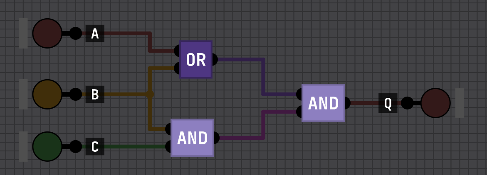

# Atividade de Álgebra Booleana — Resolução

Notação: `+` = OU (soma lógica), `·` = E (produto lógico), `~X` = NÃO X.

Cada questão tem o circuito correspondente no projeto
`Projects/ALGEBRA-BOOLEANA` — o nome do chip está indicado em cada item.

---

## 1. Identidades básicas

> Circuito: **`Q1-IDENTIDADES`** (entradas A–F, uma saída por item)

| | Expressão | Simplificada | Identidade usada |
|---|---|---|---|
| a) | `A + 0` | `A` | Elemento neutro da soma |
| b) | `B + 1` | `1` | Elemento absorvente (dominante) da soma |
| c) | `C + C` | `C` | Idempotência da soma |
| d) | `D · 1` | `D` | Elemento neutro do produto |
| e) | `E · 0` | `0` | Elemento absorvente (dominante) do produto |
| f) | `~(~F)` | `F` | Dupla negação (involução) |

Observando no simulador: as saídas `B+1` e `E·0` ficam travadas em 1 e em 0
independentemente do que você fizer com as entradas. As outras quatro copiam
exatamente a entrada correspondente.

---

## 2. Propriedades comutativa e associativa

> Circuitos: **`Q2-ASSOCIATIVA-OU`** e **`Q2-ASSOCIATIVA-E`**

### a) `A + (B + C)`

| Propriedade | Forma equivalente |
|---|---|
| Associativa | `A + (B + C) = (A + B) + C` |
| Comutativa | `A + (B + C) = (B + C) + A` |

A associativa muda **o agrupamento** dos parênteses; a comutativa muda **a
ordem** dos termos. Nenhuma das duas altera o valor lógico.

### b) `(A · B) · C`

| Propriedade | Forma equivalente |
|---|---|
| Associativa | `(A · B) · C = A · (B · C)` |
| Comutativa | `(A · B) · C = C · (A · B)` |

Nos dois circuitos as duas saídas são construídas com portas diferentes,
agrupadas de formas diferentes — e acendem sempre juntas.

---

## 3. Distributiva e fatoração

> Circuitos: **`Q3-DISTRIBUTIVA`** (itens a, b, c) e **`Q3-FATORACAO`** (item d)

### a) Expandir `A · (B + C)`

```
A · (B + C) = A·B + A·C          distributiva do produto sobre a soma
```

### b) Fatorar `AB + AC`

```
A·B + A·C = A · (B + C)          distributiva (caminho inverso)
```

Os itens (a) e (b) são a mesma igualdade lida nos dois sentidos — por isso um
único circuito mostra os dois.

### c) Expandir `X · (Y + Z)`

```
X · (Y + Z) = X·Y + X·Z          distributiva
```

### d) Fatorar `MN + ~MN`

```
M·N + ~M·N = N · (M + ~M)        fatoração (distributiva ao contrário)
           = N · 1               complementaridade:  M + ~M = 1
           = N                   elemento neutro do produto
```

**Resultado: `MN + ~MN = N`.** O circuito `Q3-FATORACAO` mostra que a saída não
depende de M — só de N.

---

## 4. Simplificação de expressões booleanas

> Circuitos: **`Q4-1`** a **`Q4-5`** — cada um com a saída original e a
> simplificada lado a lado.

### 1) `A + AB`

```
A + A·B = A·(1 + B)              fatoração
        = A·1                    elemento dominante da soma:  1 + B = 1
        = A                      elemento neutro do produto
```

**`A + AB = A`** — lei da absorção.

### 2) `ABC + 1`

```
A·B·C + 1 = 1                    elemento dominante da soma:  X + 1 = 1
```

**`ABC + 1 = 1`** — a saída é constante, não depende de nenhuma entrada.

### 3) `A + AB + ABC`

```
A + A·B + A·B·C = A·(1 + B + B·C)   fatoração
                = A·1               1 + qualquer coisa = 1
                = A
```

**`A + AB + ABC = A`** — absorção aplicada duas vezes.

### 4) `A + ~AB + ~ABC`

```
A + ~A·B + ~A·B·C = A + ~A·B·(1 + C)    fatoração dos dois últimos termos
                  = A + ~A·B·1          1 + C = 1
                  = A + ~A·B
```

Agora o termo `A + ~A·B`:

```
A + ~A·B = (A + ~A) · (A + B)    distributiva da soma sobre o produto
         = 1 · (A + B)           complementaridade:  A + ~A = 1
         = A + B
```

**`A + ~AB + ~ABC = A + B`.**

### 5) `(A+B)(A+C) + A`

```
(A + B)·(A + C) = A + B·C        distributiva da soma sobre o produto
```

Substituindo:

```
A + B·C + A = A + B·C            idempotência:  A + A = A
```

**`(A+B)(A+C) + A = A + BC`.**

---

## 5. Circuito lógico e simplificação

> Circuitos: **`Q5-ORIGINAL`**, **`Q5-SIMPLIFICADO`** e **`Q5-COMPARACAO`**



### 5.1 Expressão booleana para Q

Lendo o circuito da esquerda para a direita:

- a porta **OR** recebe **A** e **B** → `A + B`
- a porta **AND** de baixo recebe **B** e **C** → `B · C`
- a porta **AND** da direita recebe as duas saídas anteriores

```
Q = (A + B) · (B · C)
```

### 5.2 Simplificação

```
Q = (A + B) · (B · C)
  = (A + B) · B · C              associativa
  = (A·B + B·B) · C              distributiva
  = (A·B + B) · C                idempotência:  B·B = B
  = B·(A + 1) · C                fatoração
  = B · 1 · C                    elemento dominante:  A + 1 = 1
  = B · C
```

**Q = B · C**

Conferindo pela tabela-verdade — as duas colunas finais são idênticas:

| A | B | C | A+B | B·C | Q = (A+B)·(B·C) | B·C |
|---|---|---|---|---|---|---|
| 0 | 0 | 0 | 0 | 0 | **0** | **0** |
| 0 | 0 | 1 | 0 | 0 | **0** | **0** |
| 0 | 1 | 0 | 1 | 0 | **0** | **0** |
| 0 | 1 | 1 | 1 | 1 | **1** | **1** |
| 1 | 0 | 0 | 1 | 0 | **0** | **0** |
| 1 | 0 | 1 | 1 | 0 | **0** | **0** |
| 1 | 1 | 0 | 1 | 0 | **0** | **0** |
| 1 | 1 | 1 | 1 | 1 | **1** | **1** |

### 5.3 Circuito simplificado

Uma única porta AND:

```
B ──┐
    ├─[ AND ]── Q
C ──┘
```

É exatamente o chip `Q5-SIMPLIFICADO`.

### 5.4 Comparação e ganhos

| | Circuito original | Circuito simplificado |
|---|---|---|
| Portas lógicas | 3 (1 OR + 2 AND) | 1 (AND) |
| Entradas usadas | 3 (A, B, C) | 2 (B, C) |
| Níveis lógicos (profundidade) | 2 | 1 |
| Conexões | 5 | 2 |

**Ganhos:**

- **Redução de 3 para 1 porta (−66 %)** — menos área no chip e menos custo de
  componentes.
- **A entrada A é irrelevante.** O termo `A + 1 = 1` mostra que o valor de A
  nunca influencia Q. O circuito original gasta uma porta OR inteira para
  produzir um resultado que é descartado logo em seguida.
- **Atraso de propagação cai pela metade** — de 2 níveis de porta para 1. Em
  circuito síncrono isso permite clock mais alto.
- **Menos consumo de energia e menos pontos de falha**, já que há menos portas
  e menos conexões.

O chip `Q5-COMPARACAO` liga as duas versões nas mesmas entradas A, B e C: as
saídas `Q ORIGINAL` e `Q SIMPLIFICADO` acendem sempre juntas, nas 8
combinações possíveis.
